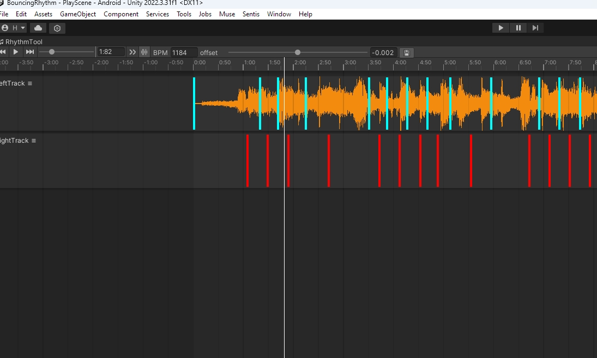

# BouncingRhythm

> Rhythm Game Editor Plugin in Unity

 

## Features

- Associate any game with custom beats
- Using Event
- A cool Editor Interface
- **Tap to Recording**

## Install

Clone the whole project and Run it. (I Only test on Unity 2022.3.31f1 and it's ok)

### Usage

if you want to use "Hit to Record Mode":

* Open the "Make Chart Scene"
* Open the Gameobject with "ChartGenerator" On it
* hit play.
* hit spacebar to Start the music and game.
* There are currently four key: D F J K stands for four kinds of keys.
* 

## Screenshot

## Environment

- Unity2022.3.31f1
- Rider as code editor

## TODO

- Completely decoupling Rhythm System
- A well-develop rhythm game

# Lisence

[GNU GPL-3.0 LICENSE](LICENSE)。
